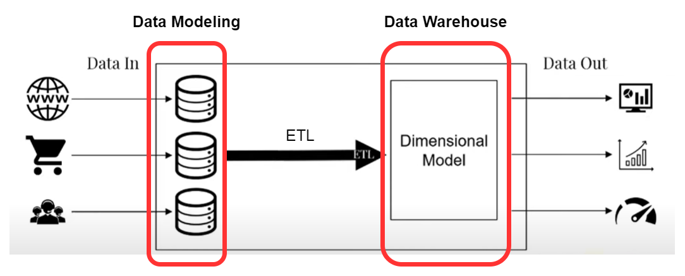

# Data Modeling and Data Warehouse

Building data model and ETL jobs.

In each folder, there is detailed information about the tasks that were performed in each project.

The first project is about creating a data model.

The second consists of taking a database and creating a data warehouse from relational tables.

This project served to gain a deeper understanding of the data journey, from its collection to its bussines analysis or use.
