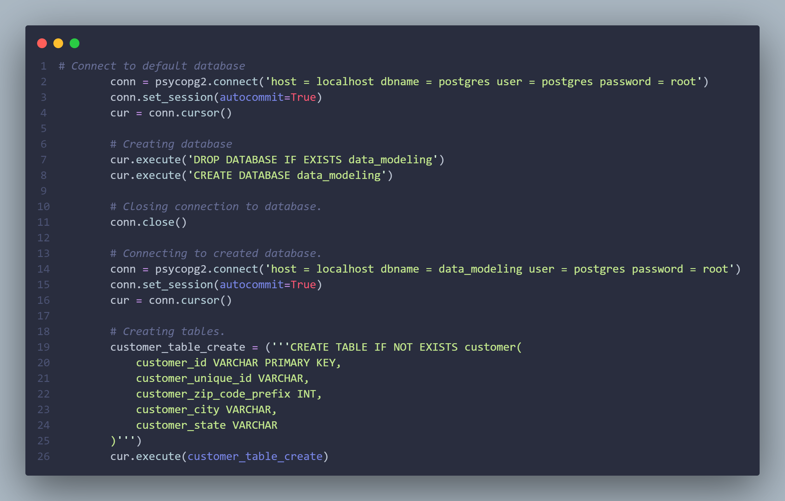

# Data Modeling project

In this project, i created a data model using PostgreSQL for database management and psycop2g for adapting Postgre to Python programming language.

I obtained a dataset from Kaggle (https://www.kaggle.com/datasets/olistbr/brazilian-ecommerce?select=olist_customers_dataset.csv) that contained various tables. 

Then performed a data model creation (creating different tables and the relations between them), so later on i could simulate a data loading process taking the data 
from the Kaggle dataset and uploading it into a PostgreSQL database.
