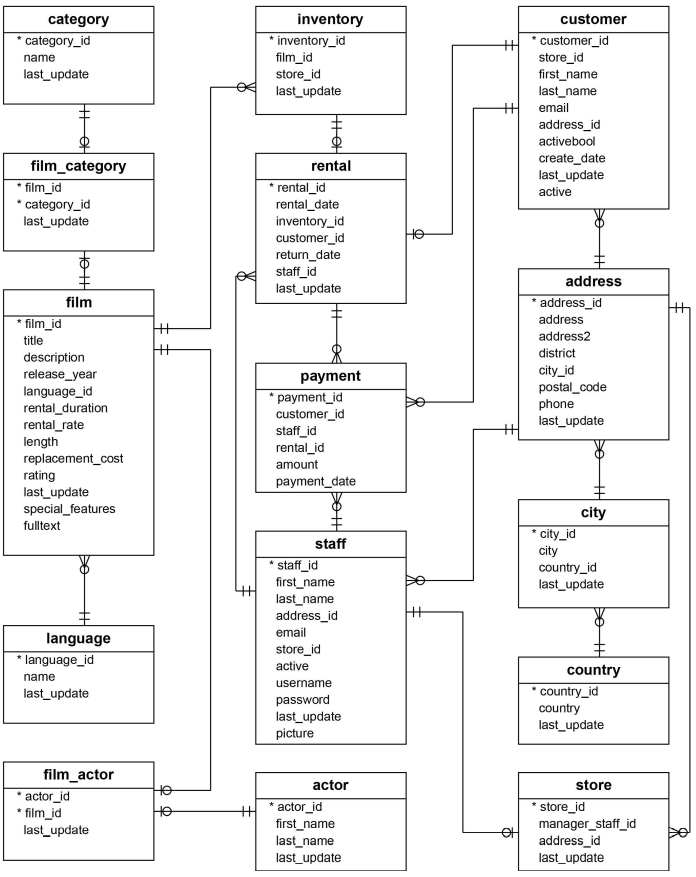
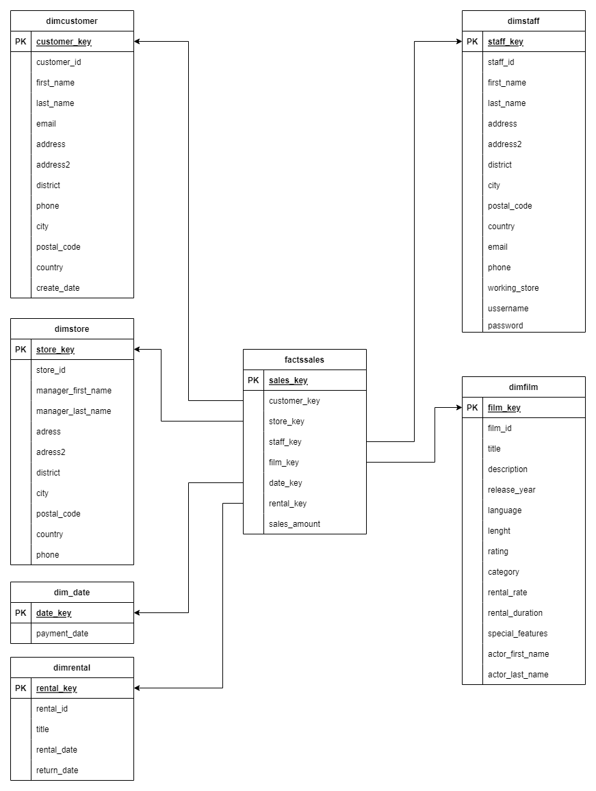

# Data Warehouse

 

The objective of this projects was to create a data warehouse from a database that i downloaded from https://www.postgresqltutorial.com/postgresql-getting-started/postgresql-sample-database/. 

I used pgAdmin4 to perform queries in order to do data analysis and observe the relations of each table within the database.

In order to build the data warehouse, i started from the ERD (Entity Relationship Diagram) observing the different relationships and studying how could i build a star schema in a way that each of the dimensional tables would contain as much information as possible.

After finishing the star schema, i performed queries and multiple joins using pgAdmin to create the data warehouse. 

The objective of building a data warehouse is to simplify queries and execution times, it is built in a way that you can easily combine all the tables, also, queries are easier to execute and understand for the business people, because there are fewer tables and the data can be obtained from tables next to each other.

This project served to gain a deeper understanding of the data journey, from its collection to its bussines analysis or use.
